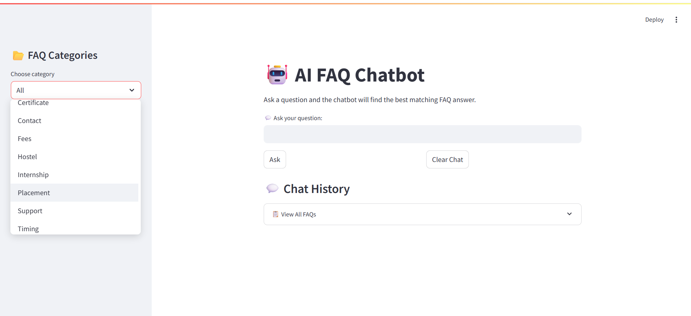
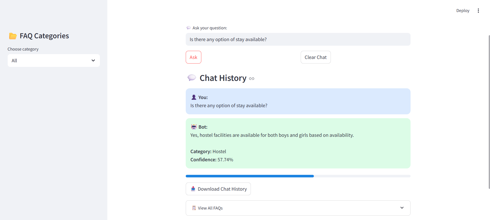
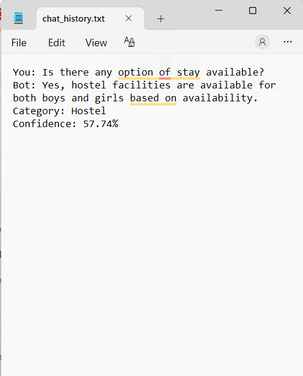
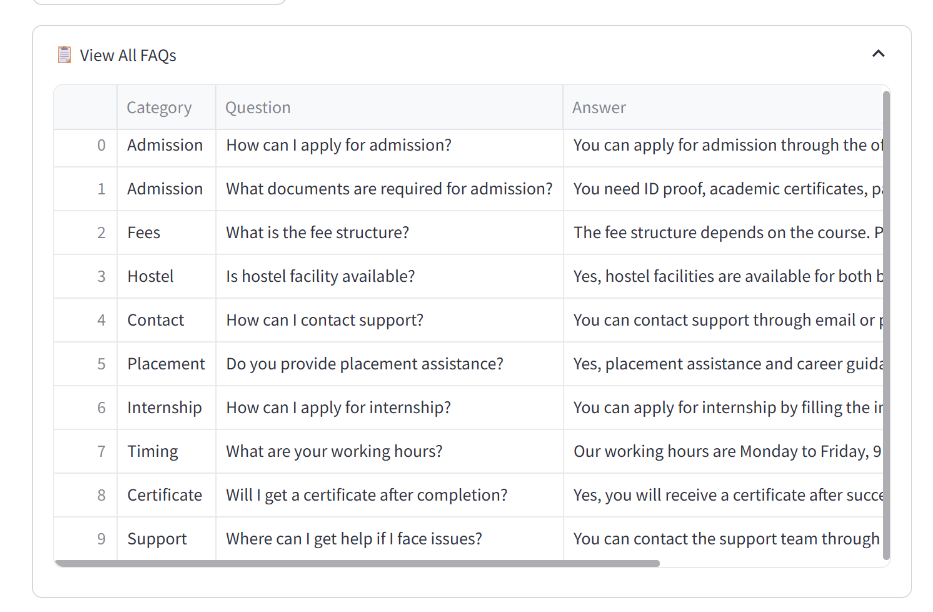

# AI FAQ Chatbot

## Project Overview

The AI FAQ Chatbot is an intelligent chatbot developed using **Python** and **Streamlit**. It answers users' questions by comparing them with a predefined set of Frequently Asked Questions (FAQs) using **Natural Language Processing (NLP)** and **Cosine Similarity**.

This project was developed as part of the **CodeAlpha Artificial Intelligence Internship**.

---

## Features

- Interactive chatbot interface
- Ask questions in natural language
- NLP-based text preprocessing
- TF-IDF Vectorization
- Cosine Similarity matching
- FAQ category filtering
- Chat history
- Confidence score for each answer
- Download chat history
- Handles unknown questions gracefully
- Clean and user-friendly Streamlit interface

---

## Technologies Used

- Python
- Streamlit
- Pandas
- NumPy
- Scikit-learn
- NLTK

---

##  Project Structure

```
FAQ_Chatbot/
│
├── app.py
├── requirements.txt
├── README.md
└── screenshots1.png
└── screenshots2.png
└── screenshots3.png
└── screenshots4.png
```

---

## Installation

### 1. Clone the repository

```bash
git clone https://github.com/sameeksha0510/codealpha_task1.git
```

### 2. Open the project folder

```bash
cd FAQ_Chatbot
```

### 3. Install the required libraries

```bash
pip install -r requirements.txt
```

### 4. Run the application

```bash
python -m streamlit run app.py
```

---

## How It Works

1. User enters a question.
2. The chatbot preprocesses the text using NLP.
3. Questions are converted into TF-IDF vectors.
4. Cosine Similarity is used to find the closest matching FAQ.
5. The chatbot displays the best matching answer along with a confidence score.

---

## Screenshots

### Home Screen


### Chat Interface

## Download Chat History

## Sample FAQ's 

---

## Future Enhancements

- Voice Input
- Text-to-Speech
- Support for multiple languages
- Database integration
- AI-powered contextual responses
- Online FAQ management

---

## 👩‍💻 Developed By

**Sameeksha B**

---

## Internship

This project was completed as **Task 2 – AI FAQ Chatbot** for the **CodeAlpha Artificial Intelligence Internship**.

---

## License

This project is created for educational and internship purposes.
